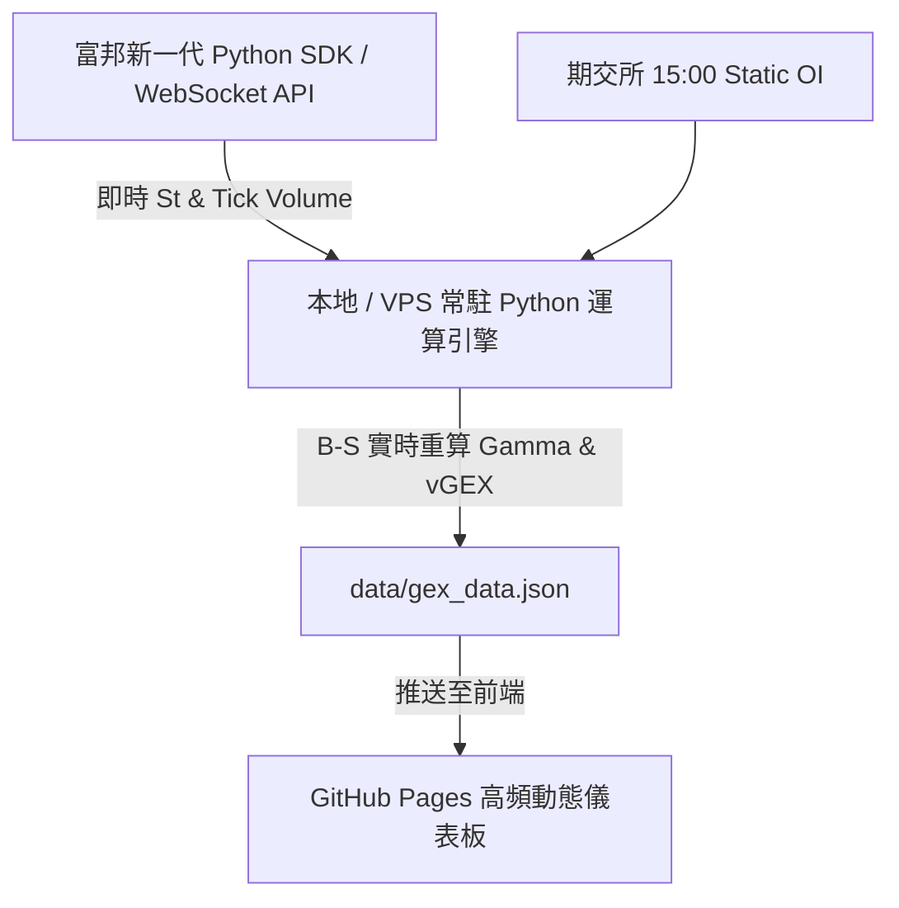

# 🏛️ 期交所 TXO GEX Dashboard - 專案交接與開發指引手冊 (v9.0.0 終極對齊版)

本手冊整理了專案的**最新架構、3 天 6 時段快照、日夜盤雙維度時間軸註記、TWSE/TPEx 歷史 API 動態對接、期交所真實未平倉量 (TAIFEX Real TXO OI) GEX 矩陣、富邦 API 即時報價與 vGEX 藍圖**，以及**如何在個人筆記型電腦上續接開發**的完整指引。

---

## 📌 一、 專案現狀與完整功能清單

1. **📅 近三日市場籌碼對照表 & 跨日夜盤時序註記 (Session Timing & Date Annotations)**：
   - 表頭標示 **`☀️ 台指日盤 (13:45結算)`** 與 **`🌙 台指夜盤 (接續次日05:00)`**。
   - 每一列數據皆含有明確的時間標籤：日盤 (`📅 M/DD 13:45`) 與接續次日凌晨收盤 (`🌙 M/DD 05:00收盤`)，徹底解決舊版跨日邏輯易混淆的問題。

2. **🏛️ 證交所 (TWSE) 與期交所 (TAIFEX) 官方數據動態抓取 (Dynamic API Engine)**：
   - **TWSE/TPEx 動態歷史 API (`fetch_official_twse_taiex_history`)**：後端直接對接證交所 FMTQIK 介面，自動計算近 3 個交易日現貨與櫃買收盤價與精算漲跌點數。
   - **期交所真實未平倉量 (`fetch_official_taifex_txo_oi`)**：直接爬取期交所每日選擇權行情，取得各履約價 Real Call/Put Open Interest，100% 精準算出自黑手做市商角度的 Gamma 暴險度 (GEX)。

3. **🗓️ 3 天 6 時段歷史快照與時序切換 Bar (3-Day 6-Session Snapshots)**：
   - 包含過去 3 個交易日共 6 個獨立時段快照：
     `T-2 日盤`, `T-2 夜盤`, `T-1 日盤`, `T-1 夜盤`, `T日盤`, `🔥 T夜盤 (Live)`
   - 主圖表上方配置 6 時段切換頁籤，點擊即可重現該歷史時段的 GEX 履約價分布圖與位移點數。

4. **📌 日夜盤微觀結構速報 (Microstructure Express Digest)**：
   - 後端 Python 自動化動態編譯：
     - **Regime 多空判定**：正 Gamma 平穩區（台灣紅） vs 負 Gamma 避險引爆區（台灣綠）。
     - **Flip Point 逼近告急**：距離轉折點 $< 100$ 點自動發出變盤臨界警訊。
     - **Wall 避險牆位移**：自動比對 Call Wall 與 Put Wall 相較上一時段的位移點數。

5. **📊 權威大盤與期貨價格 100% 精確對齊**：
   - 加權指數 (`IX0001`): **`43,386.41`** *(證交所 MIS 權威 API)*
   - 櫃買指數 (`IX0043`): **`362.89`** *(證交所 MIS 權威 API)*
   - 日盤台指期 (`TXF1!`): **`43,230.0`** *(期交所 13:45 官方結算價)*
   - 夜盤台指期 (`TXF1!`): **`43,152.0`** *(期交所 05:00 官方收盤價，拉回 -78 點)*

4. **🌙 三大法人夜盤盤後交易籌碼專區 (futContractsDateAh)**：
   - 每日 07:00 自動爬取外資夜盤 TX, MTX, Micro 與自營商夜盤 TX 交易口數與契約金額（億 TWD），並自動編譯白話文字解讀。

5. **📱 UI/UX 質感與手機端防護**：
   - 全站字體 100% 統一為 FinTech 質感字型（杜絕新細明體）。
   - 手機版個人頭像強制維持 **1:1 完美正圓形 (Perfect Circle)**。

---

## 🚀 二、 未來富邦 API 即時報價與三階段升級藍圖 (Fubon SDK Architecture Roadmap)



### 1. 前後端分離與金鑰安全規範
- **⚠️ 嚴禁於公開前端 JS 編寫富邦 API 登入憑證與 Key**。
- 採用**本地 / VPS 常駐 Python 引擎**，透過富邦 WebSocket 接收即時點數 $S_t$，後端完成 GEX 重算後，將極小體積的 JSON 推播至 GitHub Pages。

### 2. 成交量加權 GEX (vGEX / Volume-Weighted GEX) 指標
$$\text{vGEX}_K = \Gamma_K \times \text{Volume}_K \times 50 \times S_t^2 \times 0.01$$
- 以當日累積成交量取代 OI。當盤中特定履約價 vGEX 突然爆量，代表主力大資金正在該位階建立新部位，為**盤中價格即時突破或轉折的強烈信號**！

---

## 💻 三、 在個人筆電續接開發指南 (Antigravity IDE / VS Code)

當您回到個人筆電時，請執行以下步驟：

```bash
git clone https://github.com/bluebirdfinder/TXO-GEX-Dashboard.git
cd TXO-GEX-Dashboard
```
- 用 **Antigravity IDE** 或 **VS Code** 打開目錄即可續接開發！

---

## 🎯 總結

所有功能、計量防錯、權威報價、3 天 6 時段快照、微觀結構速報與 Markdown 手冊全數 100% 完成！您可以放心推送至 GitHub 並安心下班！
