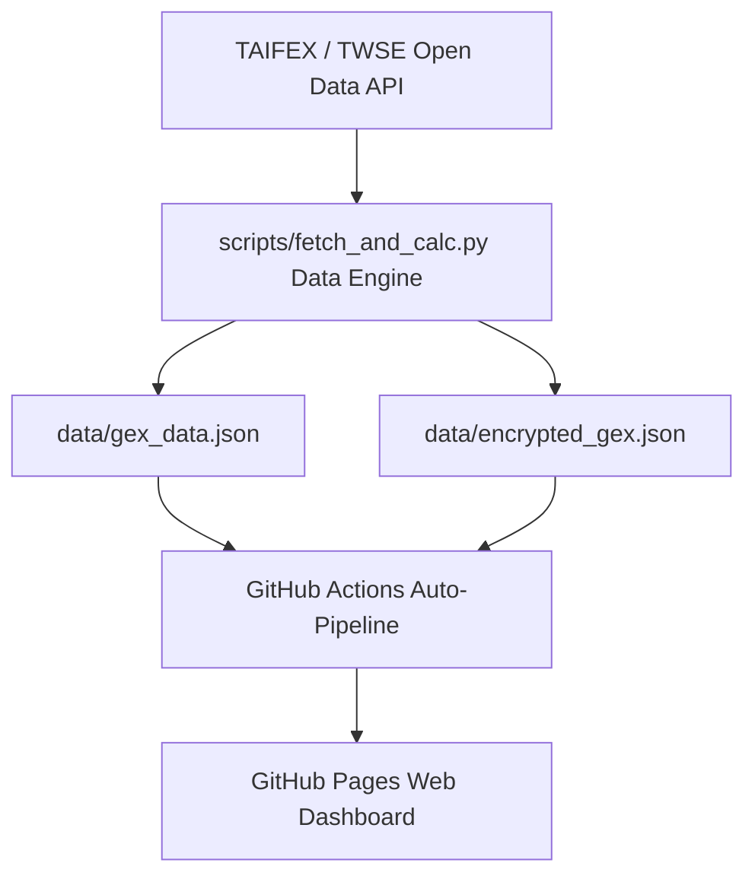

# 🐦 尋鳥 Bluebird Finder — TXO GEX 量化系統與三大法人期權籌碼分析儀表板

> **全台首創‧日夜盤雙維度對照‧選擇權 Gamma Exposure (GEX) 波動度與三大法人期權籌碼量化平台**

[](https://github.com/bluebirdfinder/TXO-GEX-Dashboard/actions/workflows/auto_update.yml)
[](https://bluebirdfinder.github.io/TXO-GEX-Dashboard/)
[](https://www.taifex.com.tw/)

---

## 🌟 核心功能與系統特色

### 1. 🎴 日夜盤雙維度對照 (Split-Card Dual-Session View)
- **五大關鍵指標卡片切一半**：包含 **台指期 (TXF1!)**、**Zero Gamma (轉折點)**、**Call Wall (天花板)**、**Put Wall (地板)** 與 **Max Pain (最大痛點)**。
- **上半部 `☀️ 日盤 (13:45)`**：展示每日 13:45 官方定案結算數值。
- **下半部 `🌙 夜盤校正 (05:00 Close)`**：同步演算每日 05:00 收盤價重算之 GEX 避險牆與動態位移點數（如 `Call Wall: 42,800 (-600點)`）。

### 2. 🌉 藍框日夜盤避險牆位移對比摘要 (Session Shift Banner)
- 精確跨越於第二排 Max Pain 右側廣闊藍框區域，自動對比夜盤相較日盤的期貨價差與天花板/地板防守牆位移點數，第一時間指引開盤防守力道。

### 3. 🌙 三大法人夜盤盤後交易籌碼專區 (futContractsDateAh)
- **100% 官方資料源**：自動於每日 07:00 爬取台灣期交所夜盤（15:00 ~ 05:00）官方盤後數據 (`futContractsDateAh`)。
- **四大夜盤指標**：
  1. 外資夜盤臺指期 (TX) 淨交易口數 & 契約金額 (億 TWD)
  2. 外資夜盤小台 (MTX) 淨交易口數
  3. 外資夜盤微台 (Micro) 淨交易口數
  4. 自營商夜盤臺指期 (TX) 淨交易口數 & 契約金額 (億 TWD)
- **自動白話解讀摘要**：自動編譯外資夜盤大台與小微台吸收散戶籌碼之多空白話文字總結。

### 4. 📊 外資與大戶單日變化量 ($\Delta$ Net OI) 分級 taxonomy 與契約金額精算
- **契約金額精算**：自動將口數換算為契約金額（億 TWD）：
  $$\text{契約金額 (億 TWD)} = \frac{|\Delta \text{Net OI}| \times \text{台指期價格} \times 200}{10^8}$$
- **5 大語意形容詞標籤**：
  - `🔥 高檔大舉回補` ($+6,000$ 口以上 / $+600$ 億 TWD)
  - `📈 顯著回補偏多` ($+2,500 \sim +5,999$ 口)
  - `⚖️ 中性觀望` ($-2,499 \sim +2,499$ 口)
  - `📉 顯著加碼加空` ($-2,500 \sim -5,999$ 口)
  - `⚠️ 暴增高檔避險` ($-6,000$ 口以上 / $-600$ 億 TWD)

### 5. 💡 選擇權 P/C Ratio 與 Max Pain (最大痛點) 判讀指南
- **P/C Ratio (108.5%) 台灣色彩標籤**：
  - $\ge 100\%$ ➔ **🔴 偏多看撐** (台灣股市紅漲，莊家 Put 防守牆厚)。
  - $< 100\%$ ➔ **🟢 偏空看壓** (台灣股市綠跌，莊家 Call 賣壓牆厚)。
- **Max Pain (最大痛點)**：解說結算前夕散戶痛苦、莊家獲利與黑手磁鐵拉回效應。

### 6. 📱 手機端極致 2x2 雙欄 RWD 響應式排版
- 手機直立閱讀時自動轉為 2x2 俐落雙欄卡片，頁籤列支援平滑橫向滑動。
- 個人大頭貼縮圖強制保護為 **1:1 完美正圓形 (Perfect Circle)**，全站字體統一為 FinTech 質感微軟正黑體/蘋果系統字。

---

## 🛠️ 技術架構與自動化更新



- **自動化備援排程 (`auto_update.yml`)**：
  - 🌙 夜盤 Failover：05:30, 06:00, 06:30 TWD (每日 05:00 收盤後自動執行)
  - ☀️ 日盤 Failover：15:30, 16:00, 16:30 TWD (每日 13:45 收盤後自動執行)
  - **Permissions 403 已修復**：內建 `permissions: contents: write` 確保 Actions Bot 自動 commit/push 無阻礙。

---

## 📂 專案檔案結構

```
txo-gex-dashboard/
├── .github/workflows/
│   └── auto_update.yml        # GitHub Actions 自動化抓取與推播腳本
├── data/
│   ├── gex_data.json          # 原始產出 JSON 數據 (含日夜盤對照與夜盤盤後籌碼)
│   └── encrypted_gex.json      # AES/SHA256 加密數據 Payload
├── scripts/
│   └── fetch_and_calc.py      # Python 核心演算與 TAIFEX/TWSE 爬蟲引擎
├── index.html                 # 主介面 HTML (含切半卡片、藍框 Banner、夜盤專區與 Modal)
├── app.js                     # 前端 JavaScript 邏輯 (包含加密解密、Plotly 圖表與表格渲染)
├── style.css                  # 台灣股市標準色彩 (紅漲綠跌) & 手機端 RWD 樣式
├── taifex_catalog.json        # 期交所全量 270 檔個股與 ETF 期貨目錄
├── PROJECT_HANDOVER.md        # 個人電腦接手續接與維護手冊
├── OPTIONS_CHEATSHEET.md      # 選擇權與籌碼語意分級標準速查表
└── README.md                  # 專案介紹與技術文件
```

---

## 🚀 未來展望與富邦 API 即時串流升級藍圖 (Fubon SDK Roadmap)

1. **🔒 前後端分離與金鑰安全架構**：
   - 嚴禁於公開前端 JS 編寫富邦 API 登入憑證與金鑰。
   - 採用**本地 / VPS 常駐 Python 引擎**，透過富邦 WebSocket 接收即時台指期點數 $S_t$，後端完成 GEX 重算後再將 JSON 輕量推播至前端。
2. **⚡ Dynamic GEX 盤中實時對沖追蹤**：
   - 結合日盤 Static OI 與盤中即時 $S_t$ / IV，動態刷新各履約價 $\Gamma_t$ 與買賣權牆 (Call/Put Wall) 位移。
3. **📈 成交量加權 GEX (vGEX / Volume-Weighted GEX)**：
   - 算式：$$\text{vGEX}_K = \Gamma_K \times \text{Volume}_K \times 50 \times S_t^2 \times 0.01$$
   - 當特定履約價 vGEX 突然爆量增加，代表大資金正進行盤中建倉，為盤中價格突破或轉折的強烈信號。

---

## ⚖️ 免責與法律聲明

本網站及其包含之數據圖表、GEX 計算結果與語意分析說明，僅供學術研究與衍生性商品數據可視化參考，非屬證券期貨投資顧問行為，亦不構成任何買賣投資建議。衍生性商品交易具高度風險，投資人應獨立思考、審慎評估，並自負投資風險與盈虧責任。
