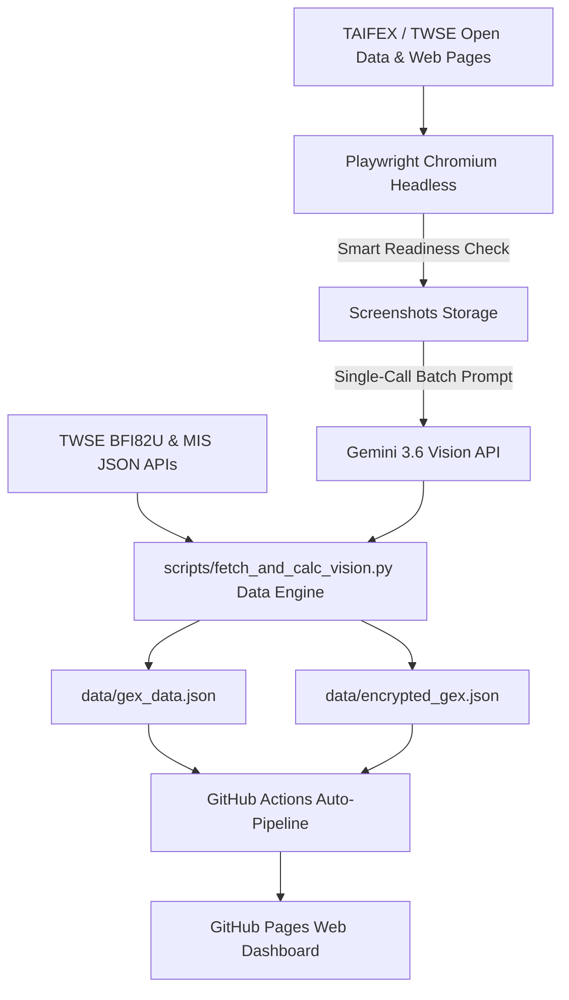

# 🐦 尋鳥 Bluebird Finder — TXO GEX 量化系統與三大法人期權籌碼分析儀表板 (v35.0)

> **全台首創‧日夜盤雙維度對照‧Playwright + Gemini 3.6 Vision 雙 Call 批次數據引擎‧選擇權 Gamma Exposure (GEX) 波動度與國際熱錢動向儀表板**

[](https://github.com/bluebirdfinder/TXO-GEX-Dashboard/actions/workflows/auto_update.yml)
[](https://bluebirdfinder.github.io/TXO-GEX-Dashboard/)
[](https://www.taifex.com.tw/)

---

## 🌟 核心功能與 v35.0 系統特色

### 1. 🤖 Playwright + Gemini 3.6 Vision 雙 Call 每日批次數據引擎
- **100% 防爬蟲阻擋與無感解析**：以 Playwright Chromium 開啟期交所與證交所 A+B 類全量網頁，使用 Gemini 3.6 Vision 進行多圖批次提取。
- **每日嚴格控制 2 次 Gemini API Call**：日盤盤後 15:30 (8 張圖片 1 次 Call) / 夜盤盤後 05:30 (4 張圖片 1 次 Call)。
- **前置數據就緒檢查 (Smart Readiness Check)**：截圖前自動判定 DOM 日期，數據未更新時自動輪詢，**零浪費 API 配額**。

### 2. 🌐 國際熱錢動向與匯率解讀 Card (Hot Money Digest)
- **國中生秒懂白話解讀**：即時與盤後追蹤 `USD/TWD`（美元/台幣）、`DXY`（美元指數）、`USD/JPY`（美元/日圓）。
- **外資資金意圖分析**：台幣強升標示「外資熱錢滾滾匯入，偏多大盤」；台幣急貶標示「外資提款落跑，防範拉回賣壓」。

### 3. 🎴 日夜盤雙維度對照 (Split-Card Dual-Session View)
- **五大關鍵指標卡片**：包含 **台指期 (TXF1!)**、**Zero Gamma (轉折點)**、**Call Wall (天花板)**、**Put Wall (地板)** 與 **Max Pain (最大痛點)**。
- **日夜盤對比位移 Banner**：自動比對夜盤相較日盤的期貨價差與避險牆位移點數。

### 4. 🎯 期交所真實未平倉量 (OI) 計算 Black-Scholes GEX
- **真實分週 GEX**：精確解析週選 (W1/W2) 與當月月選之真實 Call/Put OI，計算權威 GEX 柱狀圖、Call Wall 與 Put Wall。

### 5. 💎 個股期貨「正逆價差 (Basis)」與三大法人 Ranking
- 提供熱門個股期貨（台積電期 2330、鴻海期 2317、聯發科期 2454 等）之期現貨價差 (Basis) 與趨勢標籤。

---

## 🛠️ 技術架構與資料流程



---

## 📂 專案檔案結構

```
txo-gex-dashboard/
├── .github/workflows/
│   └── auto_update.yml        # GitHub Actions 自動化 Playwright + Vision 引擎排程
├── data/
│   ├── gex_data.json          # 原始產出 JSON 數據 (含 GEX, 籌碼, 熱錢與個股期價差)
│   └── encrypted_gex.json      # AES-256-CBC-SHA256-XOR 加密數據 Payload
├── scripts/
│   ├── fetch_and_calc_vision.py # v35.0 核心 Playwright + Gemini Vision 數據引擎
│   └── fetch_and_calc.py        # 舊版數據引擎
├── index.html                 # 主介面 HTML (含國際熱錢動向 Card、切半卡片與 Modal)
├── app.js                     # 前端 JavaScript 邏輯 (解密、Plotly 圖表與熱錢卡渲染)
├── style.css                  # 台灣股市標準色彩 (紅漲綠跌) & 手機端 RWD 樣式
├── taifex_catalog.json        # 期交所全量 270 檔個股與 ETF 期貨目錄
├── PROJECT_HANDOVER.md        # 個人電腦接手續接與維護手冊
├── OPTIONS_CHEATSHEET.md      # 選擇權與籌碼語意分級標準速查表
└── README.md                  # 專案介紹與技術文件
```

---

## 🚀 未來富邦 API 即時串流升級藍圖 (Fubon SDK Roadmap)

1. **🔒 前後端分離與金鑰安全架構**：
   - 嚴禁於公開前端 JS 編寫富邦 API 登入憑證與金鑰。
   - 採用**本地 / VPS 常駐 Python 引擎**，透過富邦 WebSocket 接收即時台指期點數 $S_t$，後端重算 GEX 後將輕量 JSON 推播至前端。
2. **⚡ 0 額度消耗之盤中即時 GEX 重算**：
   - 盤中即時 GEX 重算僅依賴本地 CPU 浮點運算，**Gemini API 使用次數完全為 0 次（全天依然維持 2 次）**。

---

## ⚖️ 免責與法律聲明

本網站及其包含之數據圖表、GEX 計算結果與語意分析說明，僅供學術研究與衍生性商品數據可視化參考，非屬證券期貨投資顧問行為，亦不構成任何買賣投資建議。衍生性商品交易具高度風險，投資人應獨立思考、審慎評估，並自負投資風險與盈虧責任。
