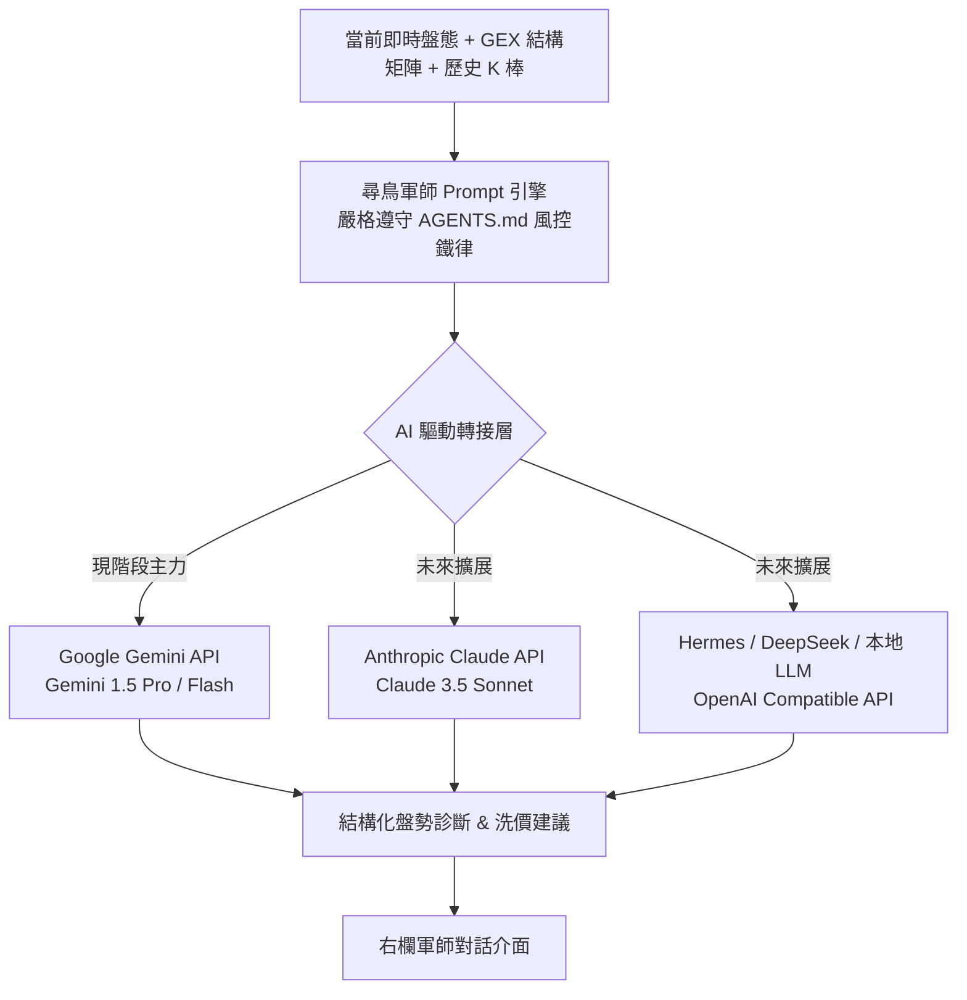

# 🦅 尋鳥交易室 (Bird Trading Room) 架構規劃與開發備忘錄

本文件記錄「老墨交易室 (tv-chart)」架構引入《尋鳥 TXO GEX 量化系統》之評估、差異化定位、技術指標遷移方案及 AI 模型擴展規劃。

---

## 📌 一、 專案定位差異分析（個股 vs TXO GEX 台指期）

| 維度 | 老墨的交易室 (MOFI Trading Room) | 尋鳥 GEX 戰情交易室 (Bird Trading Room) |
| :--- | :--- | :--- |
| **核心標的** | 個股、個股期貨 | **台指期 (TXF) + 台指選擇權 (TXO)** |
| **數據驅動源** | 券商投顧研報 (MD)、財報數據、個股技術面 | **期交所三大法人籌碼、造市商 GEX 結構矩陣、IV 波動率曲面、台指 K 線** |
| **左欄監控** | 個股清單、投顧目標價距離、個股風報比 | **台指期即時報價、週選/月選契約倒數、Net GEX 多空燈號、當日風報比** |
| **中欄圖表** | 個股 K 線 + 投顧目標價 + XQ 自訂指標 | **台指期多週期 K 線 + GEX 關鍵關卡 (Zero Gamma, Call/Put Wall) + 使用者自訂 TV 指標** |
| **右欄軍師** | 研報交叉比對、財報檢視、個股進出場診斷 | **TXO GEX 造市商動能診斷、選擇權價差策略推薦、持倉部位風控檢驗 (依據 AGENTS.md)** |

---

## 📐 二、 TradingView (Pine Script) 自訂指標遷移方案

### ❓ 使用者需求
> 使用者主要使用 TradingView 指標，其中約一半為自行撰寫的 Pine Script 技術指標，其餘為社群分享或 TV 官方內建指標。評估能否整套搬移至網頁圖表。

### ✅ 解決方案：1:1 Python 轉譯 + tv-chart 緊湊渲染
1. **免裝 TradingView 商業授權**：採用 TradingView 官方開源之 **Lightweight Charts v5+**（支援原生多 Pane）。
2. **邏輯 1:1 轉寫至 Python 計算層**：
   - 將使用者的 Pine Script 公式（如 EMA、ATR、SuperTrend、Pivot 樞紐、波段轉折點、動態通道、自訂力道計等）利用 Python (`NumPy` / `Pandas` / `Ta-Lib`) 進行 1:1 等價實作。
   - **好處 1（零漂移）**：遵守老墨規範「不要在前端寫兩套指標」，計算全部在後端統一。
   - **好處 2（源碼保密）**：前端只接收計算後的純數據，使用者的獨家 Pine Script 核心公式不會曝露在瀏覽器原始碼中。
3. **前端多層 Pane 映射**：
   - 主圖 Pane：K 線 + 支撐/壓力線段 + 疊圖指標。
   - 副圖 Pane 1：量能 / 自訂震盪指標 (Oscillators)。
   - 副圖 Pane 2：GEX 結構直方圖 / 波動率變化。
   - 標記層：買賣訊號或翻轉點（以老墨提供的零軸點位/形狀標記繪製）。

---

## 🤖 三、 AI 軍師模型架構（Gemini / Claude / Hermes 自由切換）

### ❓ 使用者需求
> 目前尚未訂閱 Claude，現有主力為 **Gemini 訂閱**，未來規劃可能加入 Claude (Sonnet) 或 Hermes / 開源模型。

### ✅ 解決方案：Model-Agnostic（模型無關）AI Agent 架構
建立統一的軍師轉接層（AI Router / Adapter），使介面與後端邏輯與具體 LLM 解耦：

1. **現階段以 Gemini 為核心**：
   - 支援超大 Context Window，可一次塞入全天 Tick、完整 GEX 履約價矩陣與選擇權未平倉分佈。
   - 反應速度極快，成本極低。
2. **無縫切換設計**：
   - 後端統一介面 `get_advisor_response(context, model_provider="gemini")`。
   - 未來切換至 Claude 或 Hermes 時，僅需更換 API Key 與 Provider 參數，前端介面與 Prompt 格式完全不用重寫。

---

## 📝 四、 未來開發里程碑備忘 (Roadmap)

- [ ] **Milestone 1**：引入本機 Lightweight Charts v5.0.9 庫，建立台指期 + GEX 關鍵價位原型。
- [ ] **Milestone 2**：將使用者的 TradingView Pine Script 指標逐一轉譯為 Python 模組。
- [ ] **Milestone 3**：前端建立獨立 `room.html` 三欄式戰情室（左：合約監控 / 中：多層圖表 / 右：軍師面板），並與 `index.html` 互相切換。
- [ ] **Milestone 4**：串接 Gemini API 實現第一代「尋鳥軍師」，並內嵌 `AGENTS.md` 風控鐵律。
- [ ] **Milestone 5**（選配）：整合富邦 SDK (`fubon_neo`) 達成盤中毫秒級即時自動更新。

---

## 🏛️ 五、 頁面架構策略：雙頁面模式 (Dual-Page Architecture)

* **`index.html`（宏觀數據儀表板）**：專注於盤後全景分析、Gamma Profile 柱狀圖、IV 波動率曲面、未平倉履約價矩陣。
* **`room.html`（尋鳥戰情交易室）**：專注於盤中即時三欄高密度盯盤、TradingView K 線多層 Pane、AI 軍師即時對話與部位診斷。
* **導覽列聯動**：兩頁面頂部均放置「一鍵切換模式」按鈕，資料與加密機制 100% 共用，現有系統零風險。

---

## 🔒 六、 私有化部署與商業化訂閱方案 (Commercialization & Private Migration)

1. **開源授權合規保障**：
   - TradingView Lightweight Charts 採 Apache 2.0 授權，**完全允許商業化、付費訂閱產品、閉源**。
   - 自訂 Pine Script 轉譯為 Python 後端邏輯，核心指標公式不對外曝露。
2. **私有化與付費訂閱路徑**：
   - **Cloudflare Pages + Worker**：前端設為 Private，透過現有 `cloudflare/worker.js` 擴展為會員 JWT 驗證與解密中心。
   - **金流串接（Stripe / 綠界 / 藍新）**：付費用戶開通專屬權限或 Token，未登入者僅能閱覽延遲/遮蔽資料。
   - **零修改遷移**：資料與介面徹底解耦，未來從 GitHub 搬遷到任何私有主機或付費平台，核心程式碼零修改直接上線。

